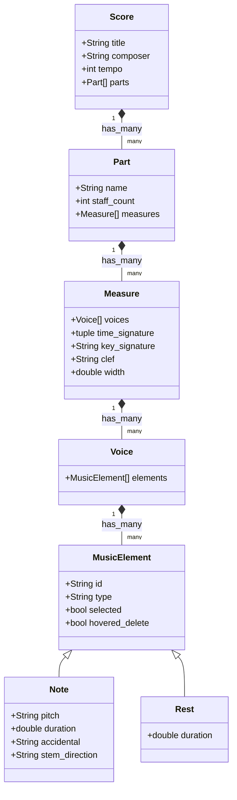

# Technical Specification: MakeMusic Finale vs. SageMusic

This document provides a comparative analysis of **MakeMusic Finale** (the legacy industry-standard desktop music notation software) and **SageMusic** (our Vulkan-powered, high-performance immediate-mode music notation app). 

The goal of this specification is to analyze Finale's core architecture, data models, layout engines, and user workflows, mapping them to SageMusic's implementation to guide future design decisions.

---

## 1. Architectural Paradigms

| Architectural Dimension | MakeMusic Finale (Legacy Enigma) | SageMusic (Vulkan Immediate-Mode) |
| :--- | :--- | :--- |
| **Engine Core** | Event-driven C++ with complex object graphs and localized dirty flags. | Immediate-mode GPU rendering (Vulkan) and immediate-mode UI (`graphics.ui`). |
| **Data Storage** | Relational-like hierarchical Enigma database (.mus / .musx). Objects reference each other via database IDs. | Object-oriented dynamic tree hierarchy (`Score` -> `Part` -> `Measure` -> `Voice` -> `MusicElement`). |
| **Rendering Strategy** | CPU-bound drawing via OS-native APIs (GDI/GDI+ on Windows, Quartz/CoreGraphics on macOS) with caching. | GPU-accelerated vertex buffering. Vertex attributes compile to SPIR-V; shapes are sampled from a SMuFL-compliant texture atlas. |
| **Layout Updates** | Lazy/On-demand justification. "Redraw" commands are manually or contextually triggered. | Real-time immediate justification pass (`layout_score`) executing on every frame before rendering. |

---

## 2. Core Data Models

### Finale: The Enigma Database Model
Historically, Finale uses the **Enigma Database** model. Rather than keeping direct memory pointers between objects, every musical element is stored in tables:
*   **Entry Records**: Represent a note or rest with attributes (duration, pitch, accidentals, flags).
*   **Measure Records**: Represent musical measures, containing pointers to the first and last Entry records and referencing clef/time/key signatures.
*   **Staff Records**: Define visual characteristics of staves (e.g., number of lines, transposed key).
*   **System/Page Records**: Define bounding boxes for physical page layouts.

### SageMusic: The Object-Oriented Tree Model
SageMusic implements an OOP hierarchy where objects hold direct parent-child references:

---

## 3. Layout & Engraving Engine Specification

### Clefs and Staff Layouts
*   **Finale**: 
    *   Supports changing clefs mid-measure. A mid-measure clef is represented as an entry flag.
    *   Renders a default clef at the start of each staff system (manuscript style). Clefs are omitted for subsequent measures in the same system unless a change occurs.
*   **SageMusic**:
    *   Implements manuscript clef styling. The clef glyph (e.g., `"gClef"`, `"fClef"`, `"cClef"`) is only drawn on the first measure of each staff (`Part`).
    *   Subsequent measures start note placement immediately at `x + 20.0`, whereas the first measure reserves `x + 65.0` to avoid overlaps.

### Horizontal Spacing and Cast Off
*   **Finale**: Implements the **Fibonacci/Golden Ratio spacing** algorithm, allocating horizontal space to notes proportionally to the square root of their duration (rather than strictly linear). Measures are then justified to fit system width.
*   **SageMusic**:
    *   Uses a simple linear heuristic inside `calculate_measure_content_width`:
        $$\text{width} = (\text{number of elements} \times 50.0) + \text{clef padding}$$
    *   Justifies measures to fit the viewport width in `layout_score` by calculating the scaling ratio:
        $$\text{scale} = \frac{\text{view width} - 100.0}{\text{total content width}}$$
        And multiplying each measure's width by this scale to stretch the staffs dynamically to the right margin.

---

## 4. Entry Tools & Workspace Workflows

### Note Entry Paradigms
*   **Simple Entry**: Selecting a note duration from a palette and clicking on the staff, or pressing computer keys (e.g., A–G for pitch, numbers 1-8 for duration).
*   **Speedy Entry**: Holding a key on a MIDI keyboard to define pitch, then pressing a number key on the computer keyboard to instantly insert the note.
*   **HyperScribe**: Real-time transcription of MIDI input with adjustable quantization.

### SageMusic Implementation (Simple Entry Style)
SageMusic maps closely to Finale's **Simple Entry** tool:
*   **Note Entry Tool**: Selects the tool and duration (Whole `1.0` through Sixteenth `0.0625`) from the **Duration Palette**.
*   **Mouse Click Interaction**: Calculates pitch dynamically by mapping the mouse Y coordinate relative to the staff lines:
    $$\text{pos} = \lfloor \frac{\text{measure } y + 32.0 - \text{mouse } y + 2.0}{4.0} \rfloor$$
    $$\text{pitch} = y\_to\_pitch(\text{measure.clef}, \text{pos})$$
    Then pushes an `AddElementCommand` onto the Undo/Redo stack.

---

## 5. Future Development Roadmap for SageMusic

Inspired by Finale's production features, the following improvements are recommended for SageMusic:

1.  **Speedy Entry Mode**:
    *   Add keybindings for pitch injection (e.g., keys `A`, `B`, `C`, `D`, `E`, `F`, `G` mapping directly to diatonic staff steps).
    *   Add number keys (`1` through `5`) to select durations immediately without clicking the palette.
2.  **Grand Staff Support**:
    *   Modify `draw_part` to support `staff_count = 2`, rendering a curly brace connecting two staves (typically Treble and Bass) for piano parts.
3.  **Standard Music Font Layout (SMuFL) Metadata**:
    *   Integrate full Bravura layout metadata (e.g., stem connection points, notehead offsets) instead of using hardcoded offset heuristics (like `x + 4` and `y - 28` for stems).
4.  **Accidental Layout Constraints**:
    *   Prevent accidentals from overlapping noteheads by calculating bounding box offsets dynamically.
